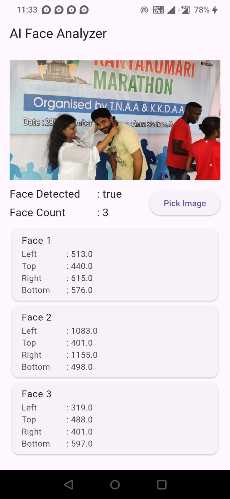
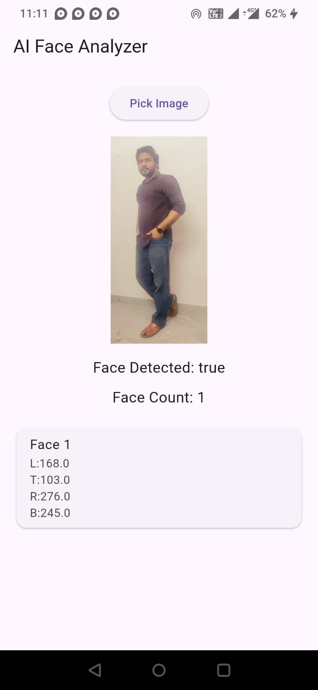
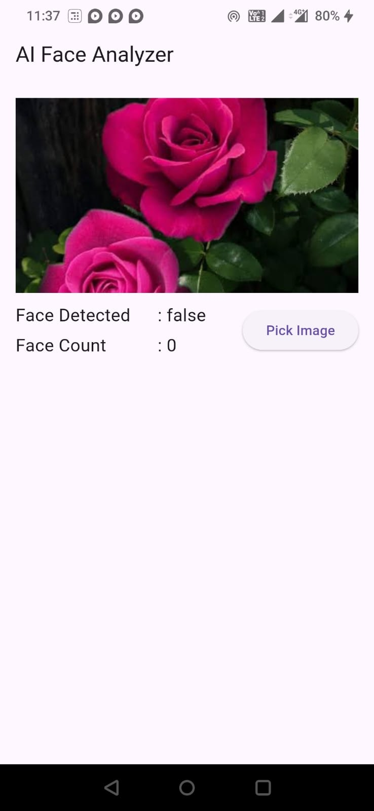

# AI Face Analyzer

[](https://pub.dev/packages/ai_face_analyzer)

Flutter plugin for on-device face detection using Google ML Kit.

## ✨ Features

- ✅ Detect one or multiple faces
- ✅ Returns face count
- ✅ Returns face bounding box coordinates
- ✅ On-device processing using Google ML Kit
- ✅ Native Android implementation

## 📱 Platform Support

| Platform | Support         |
|----------|-----------------|
| Android  | ✅               |
| iOS      | ❌ (Coming soon) |

## 📦 Installation

```yaml
dependencies:
  ai_face_analyzer: ^1.0.0
```

Run:

```bash
flutter pub get
```

## 🚀 Usage

```dart
import 'package:ai_face_analyzer/ai_face_analyzer.dart';

Future<void> main() async {
  await AiFaceAnalyzer.initialize();

  final result = await FilePicker.platform.pickFiles(type: FileType.image,);

  if (result != null) {
    final path = result.files.single.path!;

    try {
      final analysis = await AiFaceAnalyzer.analyzeImage(imagePath: path,);

      print('Face Count: ${analysis.faceCount}');

      for (final face in analysis.faces) {
        print(face);
      }
    }
    catch (e) {
      debugPrint(e.toString());
    }
  }
}
```

## 📊 Example Output

```text
Face Count : 2

Face 1
Left : 34.5
Top : 60.0
Right : 180.3
Bottom : 220.8

Face 2
...
```

## 📸 Screenshots

| Group Faces Detected                            | Single Face Detected                             | No Face Detected                              |
|-------------------------------------------------|--------------------------------------------------|-----------------------------------------------|
|  |  |  |

## 🤝 Contributing

Contributions, bug reports, and feature requests are welcome.

## 📄 License

This project is licensed under the MIT License.